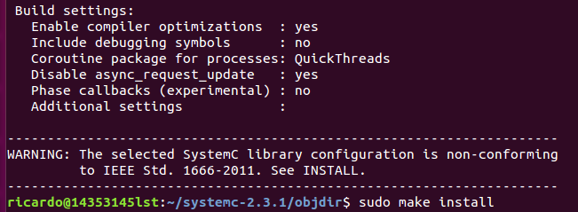
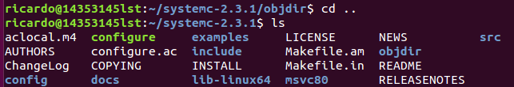
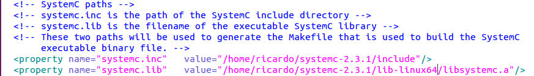
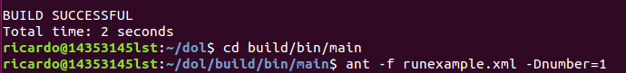

# DOL frame Description

# DOL安装笔记
上学期已经使用过ubuntu系统所以我直接开始环境配置
##1.首先安装一些必要的环境：
$	sudo apt-get update（更新我目前的ubuntu所有程序）
 
$	sudo apt-get install ant（安装ant，用于编译的工具）
 
$ sudo apt-get install openjdk-7-jdk
 
$	sudo apt-get install unzip（解压具）
##2.然后下载dol和systemc
在命令行中输入这两句话来安装
 
sudo wget http://www.accellera.org/images/downloads/standards/systemc/systemc-2.3.1.tgz
 
sudo wget http://www.tik.ee.ethz.ch/~shapes/downloads/dol_ethz.zip
##3.解压文件
新建dol的文件夹 
 
$	mkdir dol
 
将dolethz.zip解压到 dol文件夹中
 
$	unzip dol_ethz.zip -d dol
 
解压systemc
 
$	tar -zxvf systemc-2.3.1.tgz
 
##4.编译systemc
解压后进入systemc-2.3.1的目录下
 
$	cd systemc-2.3.1
 
新建一个临时文件夹objdir
 
$	mkdir objdir
 
u进入该文件夹objdir
 
$	cd objdir
 
运行configure(能根据系统的环境设置一下参数，用于编译)
 
$	../configure CXX=g++ --disable-async-updates
 
设置结果如下：

编译
 
$	sudo make install
 
至此就完成了编译systemc
 
然后可以返回上一层检查目录下有哪些文件来判断是否装好了。
 
$ cd ..
 
% ls

记录当前的工作路径
 
$	pwd

##5.编译dol
进入刚刚dol的文件夹
 
$	cd ../dol
 
然后先到文件管理器里去修改build_zip.xml文件
 
直接找到下面两句话（就在一开头）

把前面的路径改成我安装的systemc的路径，也就是上面pwd到的路径（上图已经是改好的）
 
然后是编译
 
$	ant -f build_zip.xml all
 
成功会显示build successful

然后可以做个测试（上图中已经有了语句）
结果如下

#至此就完成了dol的安装！
#实验感想
根据ppt一步步完成了安装了呢~markdown目前用起来感觉不是很方便，不比html简单多少。

