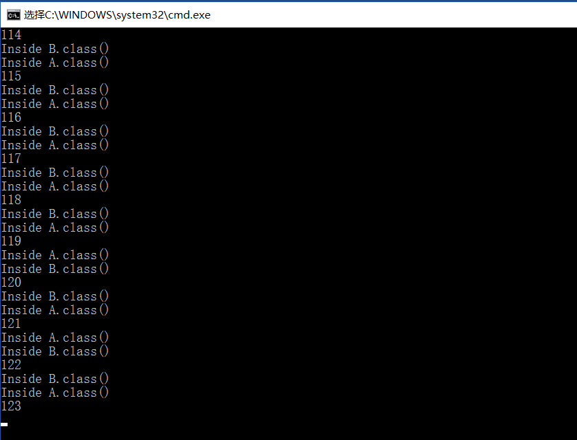

# deadlock

##截图：
 

##死锁条件：
1：互斥：涉及的资源一次只能被一个进程使用，不能共享
 
2：占有并等待：一个进程必须占有一个资源，并等待另一个资源，而这个资源被别的进程占有，而它又等待前面一个进程的资源被释放
 
3：非抢占：资源只能在用完后被释放，不能有其它方式
 
4：循环等待：上面2描述了两个进程的循环等待。多的就是再加几个
 
四个条件都需要满足

##产生死锁的解释：
每次运行时，先是生成AB对象各一个，然后把当前线程扔到调度队列里，等待调度，与此同时主程序也是在用一个循环等待一段时
 
这时，如果正好主程序循环结束同时，线程又正好被调度到了，就会出现对象a要使用b，b要使用a的情况，就产生了死锁。