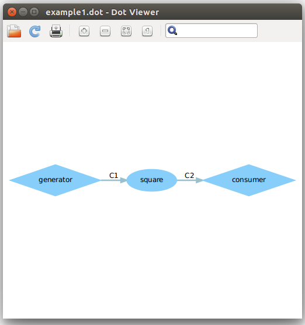
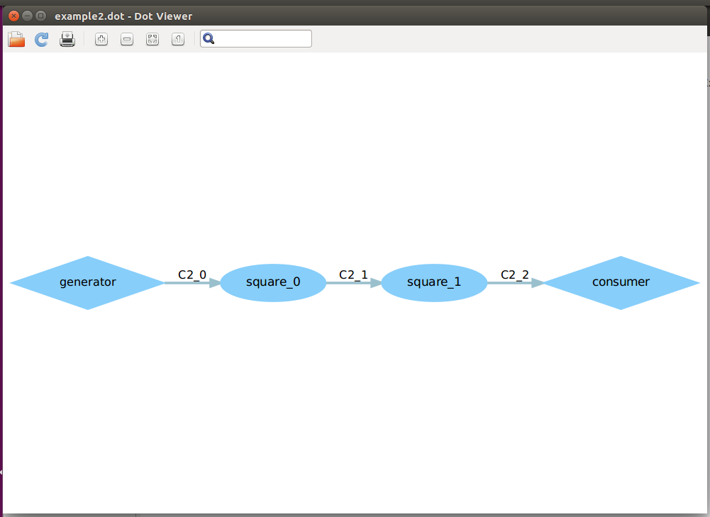
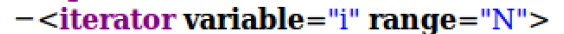
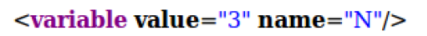
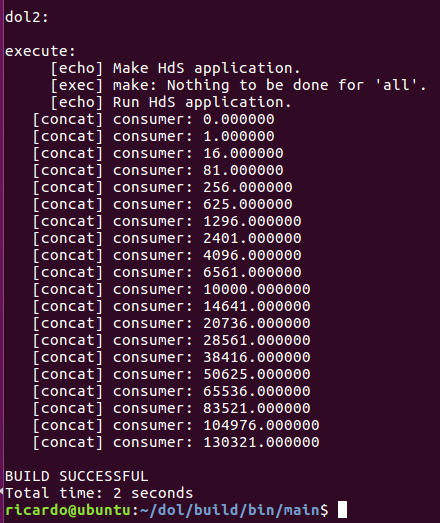

# DOL实例分析

##dot图：

 

 

##修改过程：
###1:
程序中生成square和connection的循环的迭代次数都是下图的range体现出来的
 

 
然后这里的N是在一开始的地方定义的,也就是下图
 

 
所以把这里修改成2就可以了。结果如下
 

 
###2:
原程序中的square的平方是i=i*i;实现的，所以我们要改成三次方的话.
就是i=i*i*i;