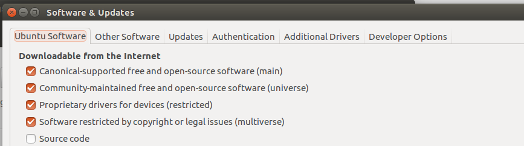
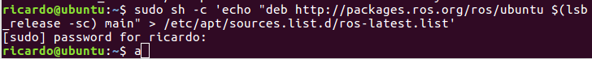
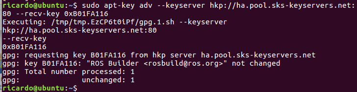
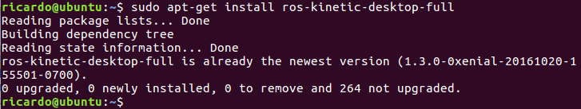
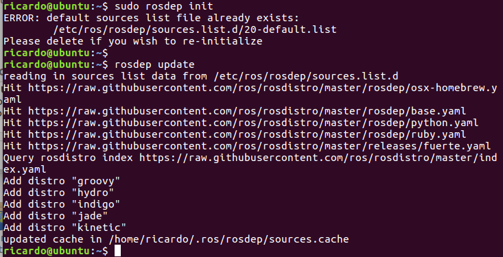
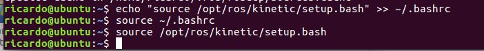
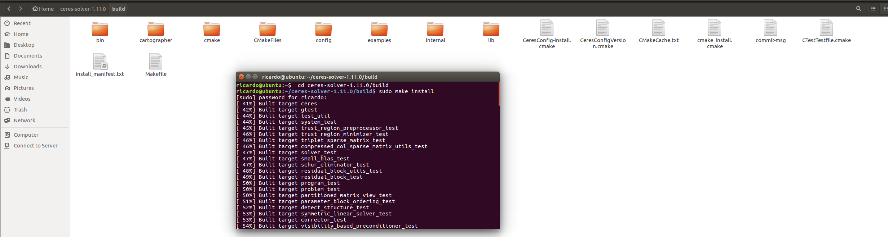
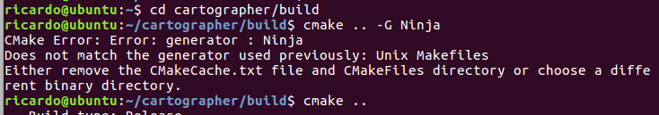
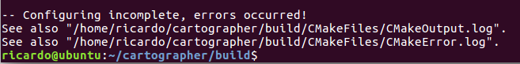

# ROS环境配置

##1.确定ubuntu的软件设置：

##2.建立源列表：
感觉是申请要安装的文件。
 

##3.设置key：

##4.安装完整版ROS：

##5.安装完后初始化：

##6.ROS环境设置：

##7.获得rosinstall：
见上图
 

#安装cartographer：
##0.安装所有依赖项：
博客里给的那堆东西有的装不了（无法locate），然后把这些删掉，重新开始装，就可以把能locate的给装了。
##1.首先安装ceres solver：
这一步完成了，build文件夹是自己建的。但是没有make -j，而是直接make。
 

 
上图体现完成了这一步。
##2.然后安装 cartographer：
这一步失败了，cmake .. -G Ninja 这个无法进行，
 

 
然后直接cmake ..,还是会报错，看了下log里面的错误报告，但是看不懂。。博客下面有人有同样的问
题，但是没有解答orz
 
